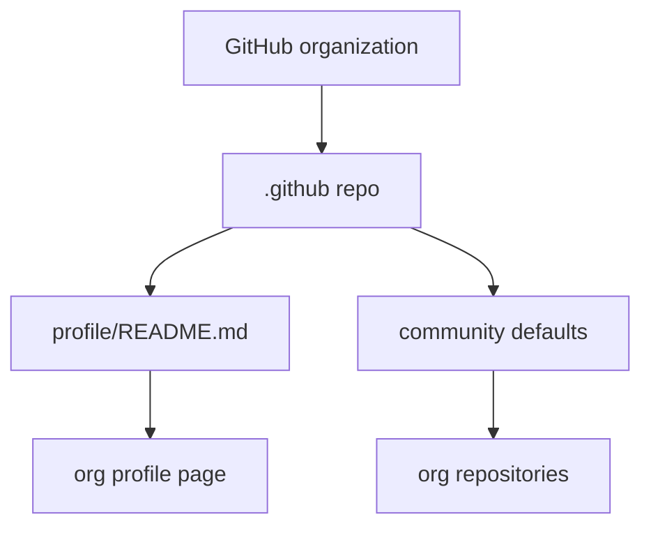
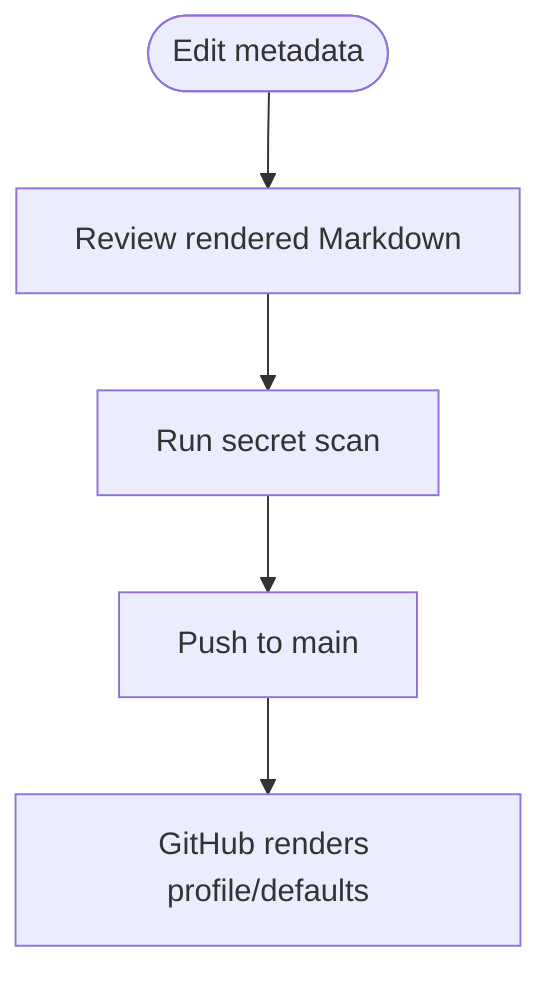

# Apex Radius GitHub Defaults

This repository controls Apex Radius organization-facing GitHub metadata. The main public surface is
`profile/README.md`, which renders on the organization profile page.

```bash
git clone https://github.com/apexradius/.github.git
```

---

## Start Here

| You are | Start with | Time |
|---|---|---:|
| Updating the org profile | `profile/README.md` | 5 min |
| Checking repo purpose | [docs/architecture.md](docs/architecture.md) | 5 min |
| Adding community defaults | Add the standard GitHub file at the repo root | 10 min |

---

## Architecture



---

## Primary Workflow



---

## What's Inside

| Path | Purpose |
|---|---|
| `profile/README.md` | Public Apex Radius organization profile text. |
| `docs/architecture.md` | Repository role and workflow diagram. |

---

## Verification

```bash
git diff --check
gitleaks detect --source . --no-banner --redact
```

Confirm the rendered profile at `https://github.com/apexradius`.

## Reference

- [Architecture](docs/architecture.md)
