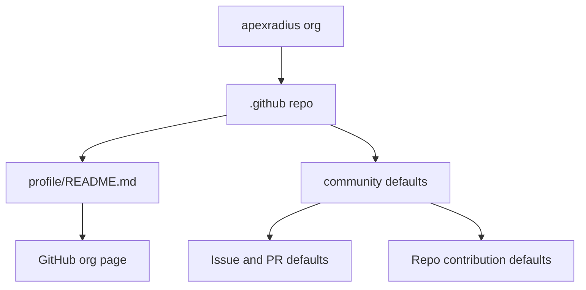
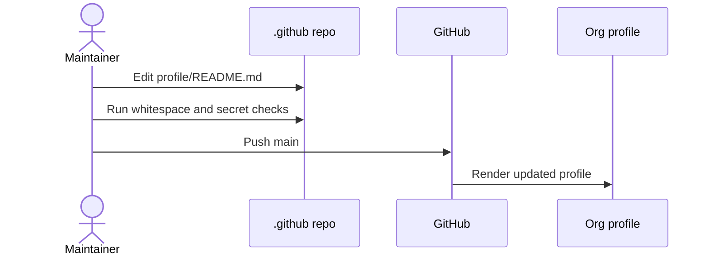

# Architecture

The `.github` repository is a GitHub metadata repo. It does not ship software; it supplies
organization-level presentation and optional default community files.

## Component Map

## Update Sequence

## Rules

- Keep profile copy concise and public-safe.
- Do not include secrets, private client details, or operational runbooks.
- Put repo-wide standards in Apex_Core; keep this repo focused on GitHub metadata.
