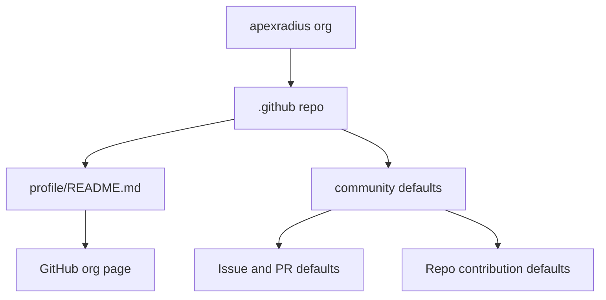

# Architecture

The `.github` repository is a GitHub metadata repo. It does not ship software; it supplies
organization-level presentation and optional default community files.

## Component Map

## Update Sequence

Follow the [contribution and publication process](../CONTRIBUTING.md#publishing-this-metadata-repository).
GitHub rendering and community-default inheritance are external state, not
established by local source checks.

## Rules

- Keep profile copy concise and public-safe.
- Do not include secrets, private client details, or operational runbooks.
- Canonical runtime governance belongs in ApexOS; keep this repo focused on GitHub metadata.
